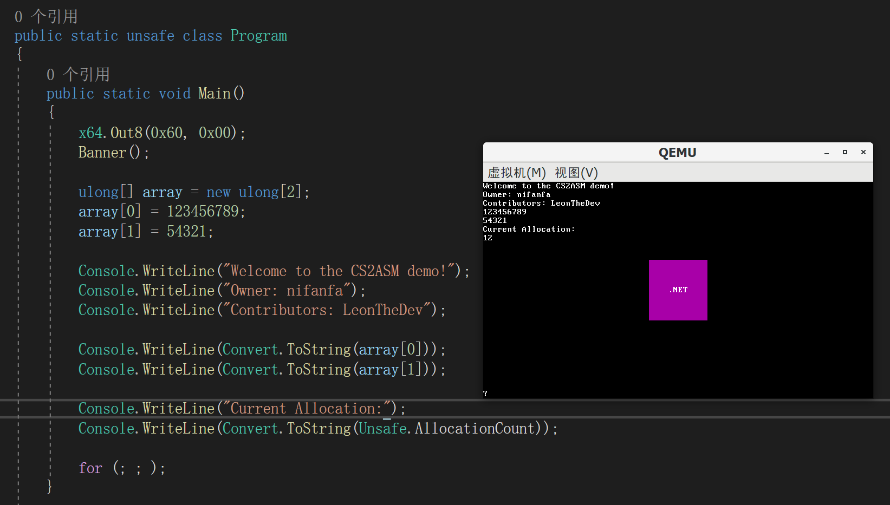

# CS2ASM
CS2ASM is a compiler which translates C# code into x86 assembly. 
By using this compiler, you may create your own operating system using any language that compiles to CIL.

## Usage
``CS2ASM -a<address> -c<amd64> -f<bin,elf> -t<none,iso> -o<output> <input>``

For example:

``./CS2ASM -a0x100000 -camd64 -felf -tiso -ooutput.iso ConsoleApp1.dll``

You can now try to run on bare metal, or via QEMU:

``qemu-system-x86_64 -cdrom output.iso -cpu max -m 1G -enable-kvm -serial stdio``

**Be sure to remove the ``-enable-kvm`` argument if you're not on Linux!**

## System.Private.Corlib
CS2ASM includes a (**very incomplete**) version of the .NET core library.

## System.Platform.Amd64
CS2ASM also includes a neat ``System.Platform.Amd64`` namespace where simple drivers reside.

## Playground.ConsoleApp1
For the sake of simplicity, an example operating system that uses the ``System.Platform.Amd64`` namespace has been included.

## Notes
**CS2ASM is not IL2CPU!** 
**Currently, only the AMD64 platform is supported.**
